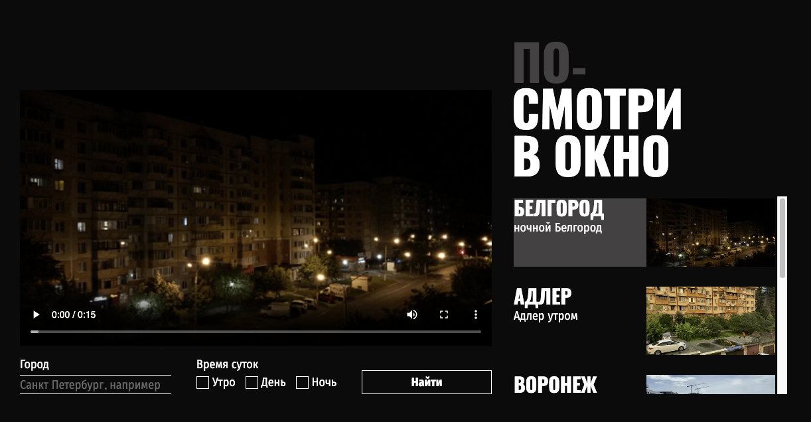

# Посмотри в окно

Данное приложение позволяет "выглянуть" из окон самых разных городов мира.

## Запуск

- Склонируйте репозиторий с помощью команды терминала `git clone https://github.com/ibragim-ast/posmotri_v_okno.git`
- Запустите приложение с помощью расширения VS code "Live Server"

## Ссылки

[Репозиторий](https://github.com/ibragim-ast/posmotri_v_okno)
[Демо](ibragim-ast.github.io/posmotri_v_okno)
